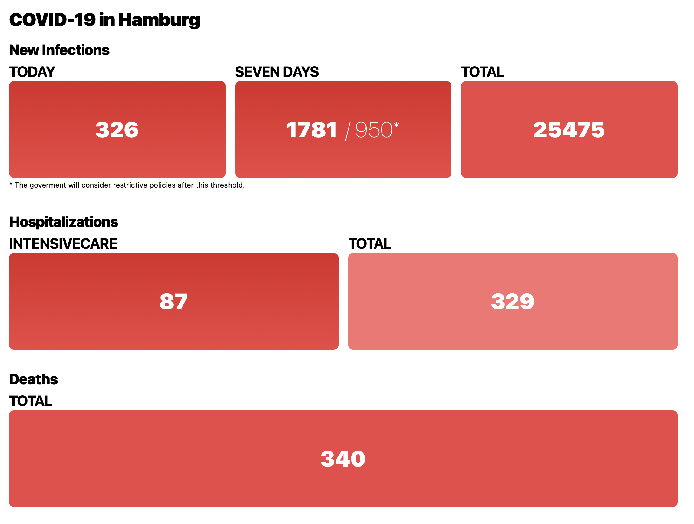

# COVID-19 in Hamburg

A dashboard showing the current Covid-19 numbers in Hamburg, Germany.

The [dashboard](https://oem.github.io/covid19/) is color-coded to visualize the current severity.

## Development

Install all dependencies with `npm i`.

Then run the dev server with `npm run dev`.

To create a release build: `npm run build`.

## Deployment

This is hosted as a github page, simply push the most current assets to the gh-pages branch.

You will need to namespace the assets in `index.html` with `/covid/...` in this gh-pages setup.

So, for example a quick `sd '="/index' '="/covid/index' index.html`.
